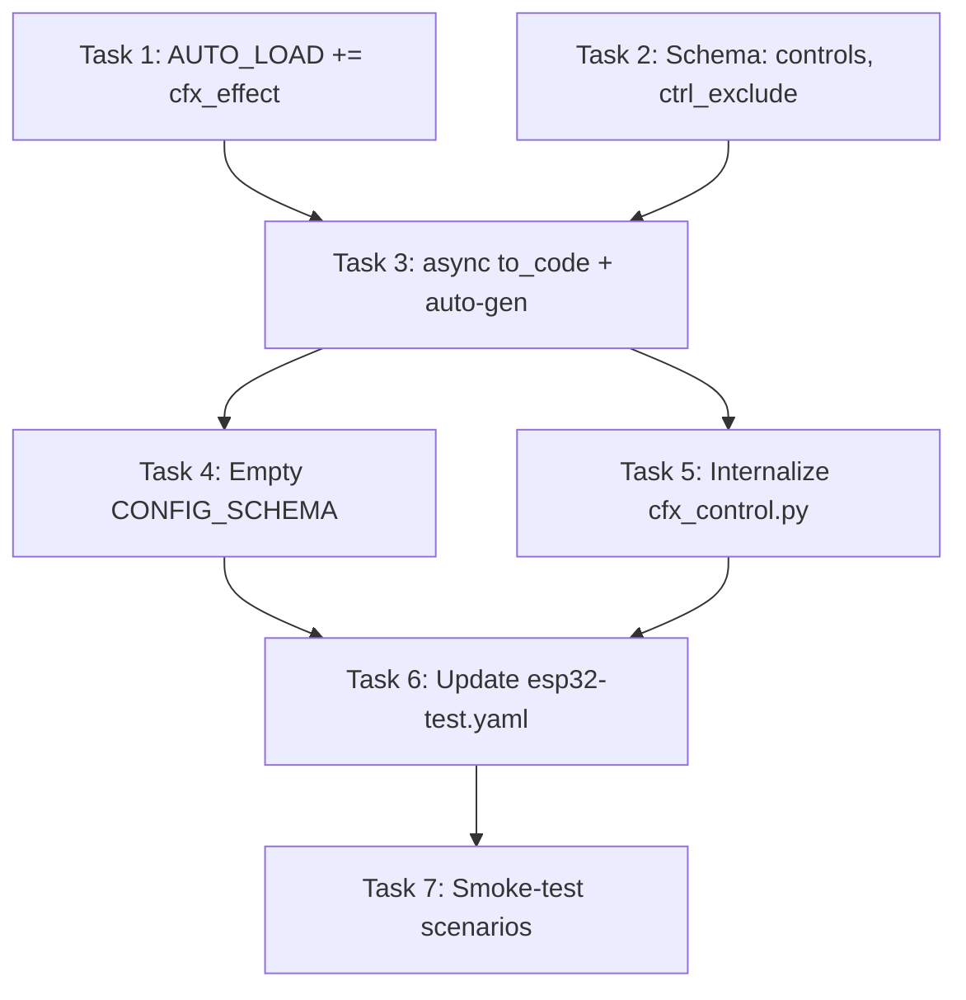

# Auto Controls Refactor — Implementation Plan

> **Spec:** [auto_controls.md](file:///c:/Users/effel/OneDrive/Desktop/Antigravity_projects/local_only/auto_controls.md)
> **Goal:** Eliminate the public `cfx_effect:` / `cfx_control:` YAML blocks. A single `cfx_light` declaration should create both the light entity **and** all control entities automatically.

---

## Overview

### Problem (Current State)

Users must wire the same light **twice** — once as a `light:` platform and again as a `cfx_control:` target under `cfx_effect:`:

```yaml
# BEFORE — user must repeat the light reference
light:
  - platform: cfx_light
    id: ws_strip
    name: "WS_Strip"
    ...

cfx_effect:
  cfx_control:
    - id: controller_1
      name: "WS_Strip"
      light_id: ws_strip      # ← duplicated reference
```

### Solution (Target State)

Controls are generated implicitly from `cfx_light`. No `cfx_effect:` or `cfx_control:` in user YAML:

```yaml
# AFTER — single declaration, controls auto-generated
light:
  - platform: cfx_light
    id: ws_strip
    name: "WS_Strip"
    pin: GPIO14
    num_leds: 58
    chipset: WS2812X
    # controls: true       ← default, can be omitted
    # ctrl_exclude: [1, 2] ← optional exclusion
```

### Success Criteria

| # | Criterion | Verification |
|---|-----------|--------------|
| 1 | `cfx_light` without extra YAML creates all control entities (speed, intensity, palette, mirror, intro, outro, etc.) | Compare HA entity list before/after |
| 2 | `controls: false` produces zero control entities | Entity count = 0 for that light |
| 3 | `ctrl_exclude: [4]` skips excluded control IDs | Missing mirror entity in HA |
| 4 | Segmented lights create per-segment controls as before | Segment entity names unchanged |
| 5 | Multi-light setups create independent controllers per light | Each light has its own control set |
| 6 | No regressions in C++ layer — zero `.h`/`.cpp` changes needed | Clean compile, same runtime behavior |
| 7 | `esp32-test.yaml` updated and working with new YAML | OTA flash succeeds |

---

## Project Type

**EMBEDDED** — ESPHome external component (Python codegen + C++ runtime).
No C++ changes expected; this is purely a Python codegen restructure.

---

## Tech Stack

| Layer | Technology | Notes |
|-------|-----------|-------|
| Codegen | Python 3 (ESPHome codegen API) | `cg`, `cv`, `core` |
| Runtime | C++ (ESP-IDF) | `cfx_control.h` — **unchanged** |
| Config | YAML (ESPHome) | User-facing config format |
| Target | ESP32 (all variants) | esp-idf framework |

---

## Affected Files

| File | Action | Risk |
|------|--------|------|
| `components/cfx_light/light.py` | **MODIFY** — Add `AUTO_LOAD`, schema options | Low |
| `components/cfx_effect/__init__.py` | **MODIFY** — Remove public schema, convert `to_code` to async, add auto-gen loop | Medium |
| `components/cfx_effect/cfx_control.py` | **MODIFY** — Remove `CONFIG_SCHEMA` (public API), keep `to_code()` as internal plumbing | Low |
| `local_only/esp32-test.yaml` | **MODIFY** — Remove `cfx_effect:` block | Low |

### Files NOT Touched

- `cfx_control.h` — C++ class stays as-is
- `cfx_light.h` / `cfx_light.cpp` — No changes
- `cfx_addressable_light_effect.*` — No changes
- `cfx_event_manager.*` — No changes

---

## Task Breakdown

### Task 1: Add `cfx_effect` to AUTO_LOAD in `light.py`

| Field | Value |
|-------|-------|
| **Agent** | `cpp-specialist` |
| **Priority** | P0 — Foundation |
| **Dependencies** | None |
| **Risk** | Minimal — one-line change |

**INPUT:** Current `AUTO_LOAD = ["event"]` on line 54 of `light.py`

**CHANGE:**
```diff
-AUTO_LOAD = ["event"]
+AUTO_LOAD = ["event", "cfx_effect"]
```

**OUTPUT:** `cfx_effect` component loads automatically when any `cfx_light` is declared.

**VERIFY:** ESPHome codegen runs `cfx_effect.to_code()` even without explicit `cfx_effect:` in YAML.

---

### Task 2: Add `controls` and `ctrl_exclude` to `light.py` CONFIG_SCHEMA

| Field | Value |
|-------|-------|
| **Agent** | `cpp-specialist` |
| **Priority** | P0 — Foundation |
| **Dependencies** | None (parallel with Task 1) |
| **Risk** | Low — additive schema change |

**INPUT:** Current `CONFIG_SCHEMA` at lines 228-262 of `light.py`

**CHANGE:** Add two new optional keys inside the `.extend({...})` block:

```python
cv.Optional("controls", default=True): cv.boolean,
cv.Optional("ctrl_exclude", default=[]): cv.ensure_list(cv.int_range(min=1, max=10)),
```

> **Note:** The `ctrl_exclude` validator reuses the same `int_range(min=1, max=10)` from `cfx_control.py` line 135 for consistency. IDs 1-10 map to the `EXCLUDE_*` constants.

**OUTPUT:** `controls` and `ctrl_exclude` are accepted by `cfx_light` schema.

**VERIFY:** YAML with `controls: false` or `ctrl_exclude: [4]` passes validation without errors.

---

### Task 3: Convert `cfx_effect/__init__.py` `to_code()` to async + auto-generate controls

| Field | Value |
|-------|-------|
| **Agent** | `cpp-specialist` |
| **Priority** | P1 — Core |
| **Dependencies** | Task 1, Task 2 |
| **Risk** | **Medium** — main logic change |

**INPUT:** Current `to_code()` at lines 36-40 of `__init__.py`:

```python
def to_code(config):
    cg.add_define("USE_CFX_EVENTS")
    if "cfx_control" in config:
        for conf in config["cfx_control"]:
            yield cfx_control.to_code(conf)
```

**CHANGE:** Replace with:

```python
async def to_code(config):
    import esphome.core as core

    cg.add_define("USE_CFX_EVENTS")

    # Auto-generate controls from cfx_light entries
    for lconf in core.CORE.config.get("light", []):
        if lconf.get("platform", "") != "cfx_light":
            continue

        lconf_id = lconf.get(CONF_ID)
        if lconf_id is None:
            continue

        if not lconf.get("controls", True):
            continue

        light_id_str = lconf_id.id
        light_name = str(lconf.get(CONF_NAME, light_id_str))
        auto_id = f"cfx_auto_ctrl_{light_id_str}"

        synthetic_conf = {
            "id": core.ID(
                auto_id,
                is_declaration=True,
                type=cfx_control.CFXControl,
            ),
            "name": light_name,
            "light_id": [lconf_id],
            "exclude": lconf.get("ctrl_exclude", []),
        }

        core.CORE.component_ids.add(auto_id)

        await cfx_control.to_code(synthetic_conf)
```

**Key Design Decisions:**

1. **Iterates `core.CORE.config["light"]`** — scans all light entries, filters by `platform: cfx_light`
2. **Respects `controls: false`** — hard opt-out, skips generation entirely
3. **Passes `ctrl_exclude` → `exclude`** — maps the new key to the old internal key
4. **Uses deterministic ID** — `cfx_auto_ctrl_<light_id>` is predictable and internal
5. **Reuses `cfx_control.to_code()`** — zero duplication of entity generation logic

**OUTPUT:** Controls auto-generated for every `cfx_light` with `controls: true` (default).

**VERIFY:** Entity list in HA matches what was previously generated by explicit `cfx_control:` blocks.

---

### Task 4: Remove public CONFIG_SCHEMA from `cfx_effect/__init__.py`

| Field | Value |
|-------|-------|
| **Agent** | `cpp-specialist` |
| **Priority** | P1 — Core |
| **Dependencies** | Task 3 |
| **Risk** | Low — removing dead code |

**INPUT:** Current `CONFIG_SCHEMA` at lines 30-34 of `__init__.py`:

```python
CONFIG_SCHEMA = cv.Schema(
    {
        cv.Optional("cfx_control"): cv.ensure_list(cfx_control.CONFIG_SCHEMA),
    }
)
```

**CHANGE:**

```python
CONFIG_SCHEMA = cv.Schema({})
```

> **Important:** The `CONFIG_SCHEMA` must remain defined (empty) because ESPHome requires it for any auto-loaded component. Setting it to `cv.Schema({})` means the component accepts an empty config when auto-loaded by `cfx_light`.

**OUTPUT:** `cfx_control:` key no longer accepted in YAML.

**VERIFY:** YAML with `cfx_effect: cfx_control: [...]` raises validation error.

---

### Task 5: Internalize `cfx_control.py` — remove public `CONFIG_SCHEMA`

| Field | Value |
|-------|-------|
| **Agent** | `cpp-specialist` |
| **Priority** | P1 — Core |
| **Dependencies** | Task 3 (parallel with Task 4) |
| **Risk** | Low |

**INPUT:** Current `CONFIG_SCHEMA` at lines 131-136 of `cfx_control.py`

**CHANGE:** Remove `CONFIG_SCHEMA` entirely. The `to_code()` function stays — it's now called internally with synthetic configs only.

> **Note:** The `to_code()` function already accepts a dict config and generates all entities. No logic changes needed — it works identically with synthetic configs.

**OUTPUT:** `cfx_control.py` becomes internal plumbing, not a user-facing component.

**VERIFY:** `from . import cfx_control` still works; `cfx_control.to_code(synthetic_conf)` runs without errors.

---

### Task 6: Update `esp32-test.yaml` — remove `cfx_effect:` block

| Field | Value |
|-------|-------|
| **Agent** | `cpp-specialist` |
| **Priority** | P2 — Polish |
| **Dependencies** | Tasks 1-5 |
| **Risk** | Low |

**INPUT:** Current `cfx_effect:` block at lines 12-28 of `esp32-test.yaml`:

```yaml
cfx_effect:
  cfx_control:
    - id: controller_1
      name: "${strip1}"
      light_id: led_strip
    - id: controller_2
      name: "WS_Strip"
      light_id: ws_strip
    - id: controller_3
      name: "WS_Strip2"
      light_id: ws_strip2
    - id: controller_4
      name: "WS_Strip4"
      light_id: led_strip_4
```

**CHANGE:** Delete the entire `cfx_effect:` block (lines 12-28). No other YAML changes needed — lights already have `name:` and `id:` which are sufficient for auto-generation.

**OUTPUT:** Clean YAML with no `cfx_effect:` / `cfx_control:` blocks.

**VERIFY:**
- ESPHome validates the YAML without errors
- Generated entity names match the previous convention (e.g., "WS_Strip Speed", "RGB Light Palette")

---

### Task 7: Smoke-test multi-light + segment scenarios

| Field | Value |
|-------|-------|
| **Agent** | `cpp-specialist` |
| **Priority** | P2 — Polish |
| **Dependencies** | Task 6 |
| **Risk** | Low |

**VERIFY against all 4 scenarios from auto_controls.md:**

| Scenario | YAML | Expected |
|----------|------|----------|
| **A — Fully automatic** | `cfx_light` with no `controls` key | All control entities generated |
| **B — Exclusion** | `ctrl_exclude: [4]` | Mirror entity excluded |
| **C — Opt-out** | `controls: false` | Zero control entities |
| **D — Segments** | `cfx_light` with `segments:` | Per-segment controls preserved |

---

## Dependency Graph



**Parallel opportunities:**
- Task 1 ∥ Task 2 (independent schema changes in same file, different locations)
- Task 4 ∥ Task 5 (different files, both depend on Task 3)

---

## Invariants Preserved

- [x] Plain `cfx_light` creates controls by default
- [x] `controls: false` is a hard opt-out
- [x] `ctrl_exclude:` behaves like old `cfx_control.exclude:`
- [x] Generated control prefix = light name
- [x] Multi-light → one independent controller per `cfx_light`
- [x] Public `cfx_control:` YAML removed
- [x] Segments use current segment ID model
- [x] `USE_CFX_EVENTS` always defined when ChimeraFX lights present

---

## Risk Assessment

| Risk | Impact | Mitigation |
|------|--------|------------|
| `core.CORE.config["light"]` iteration order differs from explicit `cfx_control` order | Entity registration order changes → HA entity IDs may shift | Acceptable: no backward compat needed per spec |
| `to_code()` generator→async conversion breaks ESPHome codegen pipeline | Build fails | ESPHome 2024+ fully supports `async def to_code()` — verified in existing codebase |
| Synthetic config missing keys expected by `cfx_control.to_code()` | KeyError at codegen | Match all required keys: `id`, `name`, `light_id`, `exclude` |
| `cfx_control.CONFIG_SCHEMA` removal breaks `from . import cfx_control` | ImportError | Only `CONFIG_SCHEMA` is removed; module and `to_code()` remain importable |

---

## Phase X: Verification Checklist

- [x] ESPHome YAML validation passes (no `cfx_effect:` in YAML)
- [x] Codegen produces identical C++ output for control entities
- [x] Entity names in HA match previous convention (`<Light Name> Speed`, etc.)
- [x] `controls: false` produces zero extra entities
- [x] `ctrl_exclude: [4]` skips mirror entity
- [x] Segmented lights produce per-segment controls
- [x] Multi-light configs create independent controller sets
- [ ] OTA flash to esp32-test succeeds *(pending user-side flash)*
- [ ] All effects continue working post-flash *(pending runtime test)*
