# Sequencer (`cfx_sequence`)

A **sequence** is the way you script LED behaviour in ChimeraFX. You pick an effect, point it at one or more strips, and optionally tell it what to do at specific moments — when the animation starts, when it reaches a certain point, when it stops.

Everything runs directly on the ESP32. No round-trip to Home Assistant, no network lag.

> Already know the basics? Jump to the [full configuration reference](#configuration-reference) or the [examples](#examples).

---

## The Lifecycle

Every sequence goes through five stages. Understanding these is the key to wiring up anything non-trivial.




| Stage | Trigger                       | When it fires |
|---|-------|---|
| **Begin** | `on_cfx_begin` | The instant `cfx_sequence.start` is called. Nothing is visible yet. |
| **Start** | `on_cfx_start` | The effect is actually rendering. If there's an intro animation, this fires *after* it finishes. |
| **Reach** | `on_cfx_reach` | The effect's leading pixel crosses a threshold you define (e.g. `50%`). |
| **Stop** | `on_cfx_stop` | The outro animation begins (triggered by `cfx_sequence.stop` or `light.turn_off`). |
| **Complete** | `on_cfx_complete` | The outro finishes and the strip is fully dark. |

> **`on_cfx_stop` vs `on_cfx_complete`** - Stop fires when the fade-out *starts*. Complete fires when the strip goes fully dark. Use `on_cfx_stop` to stagger other strips in sync; use `on_cfx_complete` to know when everything is done.

---

## Your First Sequence

The minimum you need: an `id`, a `name`, a light, and an effect.

```yaml
cfx_sequence:
  - id: my_sequence
    name: "My Sequence"
    lights:
      - my_strip
    effect: "Horizon Sweep"
```

Then start it from a button, automation, or anything that runs ESPHome actions:

```yaml
on_press:
  then:
    - cfx_sequence.start: my_sequence
```

That's it. The effect runs indefinitely until you call `cfx_sequence.stop` or turn off the light.

---

## Configuration Reference

### Core options

| Key | Required | Type | Description |
|---|---|---|---|
| `id` | Yes | ID | Unique identifier. Used by `cfx_sequence.start` / `.stop`. |
| `name` | Yes | string | Display name shown in the Home Assistant dropdown. |
| `lights` | Yes | list | One or more target light IDs (must be registered under `cfx_light`). |
| `effect` | Yes | string | CFX effect name. |

### Parameter overrides

These let you lock in specific values for the duration of the sequence, overriding the HA UI sliders.

| Key                                    | Range | Description |
|--------|---|-------------|
| `set_speed` | 0-255 | Runtime-only Speed override for the active run. Does not persist to the HA slider. |
| `set_intensity` | 0-255 | Runtime-only Intensity override for the active run. Does not persist to the HA slider. |
| `set_palette` | 0-255 | Runtime-only Palette override (by index). Does not persist to the HA selector. Monochromatic effects ignore palette and force their solid-color path. |
| `set_brightness` | 0-100% | Overrides the light brightness. |
| `set_color` | `[r,g,b]` or `[r,g,b,w]` | Overrides the effect color. Use 3 channels for RGB, 4 for RGBW. |
| `set_mirror` | `true` / `false` | Overrides the Mirror switch. |
| `set_autotune` | `true` / `false` | Overrides the Autotune switch. |
| `set_force_white` | `true` / `false` | Forces the white channel on eligible RGBW / WRGB strips and SK6812-based setups. |
| `set_intro` | 0-27 | Overrides the Intro animation by index. |
| `set_outro` | 0-27 | Overrides the Outro animation by index. |
| `set_inout_dur` | float `>= 0.0` | Overrides intro/outro duration in seconds. |

Parameters stay locked until the next `light.turn_on` or `cfx_sequence.start` resets them.

### Completion control

| Key                   | Type | Default | Description |
|---|---|---|---|
| `iterations` | integer | `0` | Stop after N complete animation cycles. `0` = loop forever. |
| `duration` | time | `null` | Stop after a fixed wall-clock time (e.g. `10s`, `2min`). Takes priority over `iterations`. |
| `restore` | boolean | `true` | Restore the strip's pre-sequence light state when the sequence stops. This includes ON/OFF state, effect, brightness, colour, and colour mode snapshot. Runtime-only overrides such as `set_speed`, `set_intensity`, `set_palette`, `set_mirror`, and `set_autotune` are not persisted back to HA controls. |

`restore` is intentionally light-state oriented, not control-state oriented.

- If the light was already ON before the sequence started, `restore: true` returns it to that previous effect/colour/brightness snapshot.
- If the light was OFF before the sequence started, `restore: true` returns it to OFF.
- If a child light is adopted mid-sequence via `cfx_set`, its restore baseline is treated as OFF unless explicitly designed otherwise, so stopping the parent sequence cleans the adopted child up without leaving it running.
- `restore: false` skips the saved-state return and the teardown path forces the sequence lights OFF.

??? abstract "Full annotated example"

    ```yaml
    cfx_sequence:
      - id: seq_id
        name: "Sequence Name"
        lights:
          - light_id
        effect: "Wipe"

        # Parameter overrides
        set_speed:       200
        set_intensity:   128
        set_palette:     4
        set_brightness:  80%
        set_color:       [255, 180, 80]
        set_mirror:      true
        set_autotune:    false
        set_force_white: true
        set_intro:       12
        set_outro:       22
        set_inout_dur:   1.5

        # Completion
        iterations: 1
        duration: 5s
        restore: true

        # Triggers
        on_cfx_start:
          - logger.log: "Effect started"

        on_cfx_reach:
          - position: 10%
            then:
              - cfx_set:
                  id: another_strip
                  effect: "Horizon Sweep"

        on_cfx_stop:
          - delay: 300ms
          - light.turn_off: another_strip

        on_cfx_complete:
          - logger.log: "Outro finished, strip is dark"
    ```

---

## Triggers in Detail

### `on_cfx_begin`
Fires the moment `start()` is invoked — before any intro animation or rendering. Good for pre-arming other hardware.

=== "On-Device YAML"
      ```yaml
        cfx_sequence:
          - name: "Sequence Begin"
            id: seq_begin
            lights: 
              - led_strip
            effect: "Sonar Reveal"
            on_cfx_begin:
              - light.toggle:
                  id: ws_strip
      ```

=== "Home Assistant YAML"
      ```yaml
        alias: CFX_Begin
        description: ""
        triggers:
          - trigger: state
            entity_id:
              - light.esp32_test_rgb_light
            attribute: effect
            to:
              - Sonar Reveal
        conditions: []
        actions:
          - wait_for_trigger:
              - trigger: state
                entity_id:
                  - event.esp32_test_cfx_events
                attribute: event_type
                to:
                  - cfx_begin:rgb_light
                enabled: true
            enabled: true
          - action: light.toggle
            metadata: {}
            target:
              entity_id: light.esp32_test_ws_strip
            data: {}
        mode: single
      ```

### `on_cfx_start`
Fires when the effect is actually rendering its first frame. If the effect has an intro animation, this fires *after* the intro completes.

=== "On-Device YAML"
      ```yaml
        cfx_sequence:
          - name: "Sequence Begin"
            id: seq_begin
            lights: 
              - led_strip
            effect: "Sonar Reveal"
            on_cfx_begin:
              - light.toggle:
                  id: ws_strip
      ```

=== "Home Assistant YAML"
      ```yaml
        alias: CFX_Start
        description: ""
        triggers:
          - trigger: state
            entity_id:
              - light.esp32_test_rgb_light
            attribute: effect
            to:
              - Collider
        conditions: []
        actions:
          - wait_for_trigger:
              - trigger: state
                entity_id:
                  - event.esp32_test_cfx_events
                attribute: event_type
                to:
                  - cfx_start:rgb_light
                enabled: true
            enabled: true
          - action: light.toggle
            metadata: {}
            target:
              entity_id: light.esp32_test_ws_strip
            data: {}
        mode: single
      ```

### `on_cfx_reach`
Fires when the animation's leading pixel crosses a percentage threshold. You can define as many thresholds as you need.

=== "On-Device YAML"
      ```yaml
        cfx_sequence:
          on_cfx_reach:
            - position: 25%
              then:
                - logger.log: "Quarter way through"
            - position: 50%
              then:
                - logger.log: "Halfway"
      ```

=== "Home Assistant YAML"
      ```yaml
        alias: ChimeraFX — Logger
        description: ""
        triggers:
          - trigger: state
            entity_id:
              - event.esp32_test_cfx_events
              attribute: event_type
              to:
                - cfx_start:rgb_light
          actions:
            - wait_for_trigger:
                - trigger: state
                  entity_id:
                    - event.esp32_test_cfx_events
                  attribute: event_type
                  to:
                    - cfx_reach:rgb_light:25
            - action: persistent_notification.create
              metadata: {}
              data:
                message: Quarter way through
            - wait_for_trigger:
                - trigger: state
                  entity_id:
                    - event.esp32_test_cfx_events
                  attribute: event_type
                  to:
                    - cfx_reach:rgb_light:50
            - action: persistent_notification.create
              metadata: {}
              data:
                message: Halfway
          mode: single
      ```

> **Looping effects** - For continuous effects like Wipe or Chase, `on_cfx_reach` fires on *every* cycle. If you need a one-shot reaction, set `iterations: 1` or use a flag in your HA automation.

> **Ambient effects** - Effects without a sweep direction (Aurora, Fire, Ocean, Plasma) never fire `on_cfx_reach`. See [Effect types](#effect-types-and-cfx_reach) below.

### `on_cfx_stop`
Fires the instant the outro animation begins. This is the best trigger to coordinate multiple strips - start their outros here so everything fades in sync (or staggered with a `delay`).

=== "On-Device YAML"
      ```yaml
        cfx_sequence:
          - name: "Sequence Stop"
            id: seq_stop
            lights: 
              - led_strip
            effect: "Venetian"
            on_cfx_stop:
              - light.toggle:
                  id: ws_strip
      ```

=== "Home Assistant YAML"
      ```yaml
        alias: CFX_Stop
        description: ""
        triggers:
          - trigger: state
            entity_id:
              - light.esp32_test_rgb_light
            attribute: effect
            to:
              - Venetian
        conditions: []
        actions:
          - wait_for_trigger:
              - trigger: state
                entity_id:
                  - event.esp32_test_cfx_events
                attribute: event_type
                to:
                  - cfx_stop:rgb_light
                enabled: true
            enabled: true
          - action: light.toggle
            metadata: {}
            target:
              entity_id: light.esp32_test_ws_strip
            data: {}
        mode: single
      ```

### `on_cfx_complete`
Fires when the outro finishes and the strip is completely dark.

=== "On-Device YAML"
      ```yaml
        cfx_sequence:
          - name: "Sequence Complete"
            id: seq_complete
            lights: 
              - led_strip
            effect: "Curtain Sweep"
            on_cfx_complete:
              - light.toggle:
                  id: ws_strip
      ```

=== "Home Assistant YAML"
      ```yaml
        alias: CFX_Complete
        description: ""
        triggers:
          - trigger: state
            entity_id:
              - light.esp32_test_rgb_light
            attribute: effect
            to:
              - Curtain Sweep
        conditions: []
        actions:
          - wait_for_trigger:
              - trigger: state
                entity_id:
                  - event.esp32_test_cfx_events
                attribute: event_type
                to:
                  - cfx_complete:rgb_light
                enabled: true
            enabled: true
          - action: light.toggle
            metadata: {}
            target:
              entity_id: light.esp32_test_ws_strip
            data: {}
        mode: single
      ```

> **Heads up** - `on_cfx_complete` only fires when a real outro runs: when `duration:` expires or a monochromatic effect finishes fading. It does **not** fire on a plain `light.turn_off`. If your automation needs a "done" signal for all cases, listen to the `light.turn_off` entity state in HA instead.

---

## cfx_set - Quick Parameter Injection
cfx_set is a lightweight action for applying parameters to a light *without* declaring a full sequence. It's designed to be used inside on_cfx_reach to kick off secondary strips on cue.
```yaml
on_cfx_reach:
  - position: 25%
    then:
      - cfx_set:
          id: led_strip
          effect: "Wipe"
          set_speed: 255
          set_intensity: 128
          set_palette: 4
```

| Key                                        | Type                 | Description |
|---|---|---|
| `id` | light ID | Target light (required). |
| `effect` | string | Effect name. If set, calls light.turn_on with this effect. Omit to only change parameters without touching the current effect. |
| `set_speed` | 0-255 | Runtime-only Speed override for the active run. Does not persist to the HA slider. |
| `set_intensity` | 0-255 | Runtime-only Intensity override for the active run. Does not persist to the HA slider. |
| `set_palette` | 0-255 | Runtime-only Palette override (by index). Does not persist to the HA selector. Monochromatic effects ignore palette and force their solid-color path. |
| `set_brightness` | 0-100% | Overrides the light brightness. |
| `set_color` | `[r,g,b]` or `[r,g,b,w]` | Overrides the effect color. Use 3 channels for RGB, 4 for RGBW. |
| `set_mirror` | `true` / `false` | Overrides the Mirror switch. |
| `set_autotune` | `true` / `false` | Overrides the Autotune switch. |
| `set_force_white` | `true` / `false` | Forces the white channel on eligible RGBW / WRGB strips and SK6812-based setups. |
| `set_intro` | 0-27 | Overrides the Intro animation by index. |
| `set_outro` | 0-27 | Overrides the Outro animation by index. |
| `set_inout_dur` | float `>= 0.0` | Overrides intro/outro duration in seconds. |

---
## cfx_run - Spawn a Runtime Sequence
cfx_run starts a self-contained, pool-backed sequence at runtime. It supports the same set_* overrides as cfx_set, plus iterations and lifecycle triggers on the spawned run.
```yaml
on_cfx_reach:
  - position: 50%
    then:
      - cfx_run:
          id: led_strip
          effect: "Gas Discharge"
          set_speed: 180
          set_force_white: true
          iterations: 1
```

| Key                                        | Type                 | Description |
|---|---|---|
| `id` | light ID | Target light (required). |
| `effect` | string | Effect name to spawn (required). |
| `set_speed` | 0-255 | Runtime-only Speed override for the spawned run. Does not persist to the HA slider. |
| `set_intensity` | 0-255 | Runtime-only Intensity override for the spawned run. Does not persist to the HA slider. |
| `set_palette` | 0-255 | Runtime-only Palette override (index). Does not persist to the HA selector. Monochromatic effects ignore palette and force their solid-color path. |
| `set_brightness` | 0-100% | Brightness override. |
| `set_color` | [r,g,b] or [r,g,b,w] | Color override. |
| `set_mirror` | true / false | Mirror override. |
| `set_autotune` | true / false | Autotune override. |
| `set_force_white` | true / false | Force white-channel rendering on eligible RGBW / WRGB strips and SK6812-based setups. |
| `set_intro` | 0-27 | Intro override. |
| `set_outro` | 0-27 | Outro override. |
| `set_inout_dur` | float >= 0.0 | Intro/outro duration override in seconds. |
| `iterations` | integer | Number of cycles to run. Default is 1. |
| `on_cfx_start` | automation | Fires when the spawned effect starts rendering. |
| `on_cfx_stop` | automation | Fires when the spawned outro begins. |
| `on_cfx_complete` | automation | Fires when the spawned outro finishes. |
| `on_cfx_reach` | automation | Positional triggers for the spawned run. |

---
## Home Assistant Integration

When any `cfx_sequence` is defined, ESPHome automatically creates a **CFX Events** entity. It fires named events into HA that your automations can listen to.

### Event format

Events use the strip's slug as a tag. A light named `RGB Light` becomes the tag `rgb_light`.

| Event | When it fires |
|---|---|
| `cfx_begin:<tag>` | The instant a sequence or a single effet is called. |
| `cfx_start:<tag>` | Effect begins rendering. |
| `cfx_reach:<tag>:<pct>` | Milestone crossed - fires at **fixed 10% steps** (10, 20, 30 ... 100). |
| `cfx_stop:<tag>` | Outro begins. |
| `cfx_complete:<tag>` | Duration expired or monochromatic outro finished. |

### On-device vs HA precision

Triggers written directly in ESPHome YAML (`on_cfx_reach`) are evaluated every frame and fire at *any* threshold you define, including sub-10% ones like `33%`.

HA events are intentionally quantized to 10% steps to avoid flooding the event queue at high animation speeds. If you need sub-10% precision, use on-device triggers.

> **Don't set `batch_delay: 0ms`** in your `api:` block. It will cause `cfx_reach` events to drop at high effect speeds, regardless of `max_send_queue`. The default `batch_delay: 200ms` is the safe value.

### Effect types and `cfx_reach`

Not every effect sweeps in a direction, so `cfx_reach` doesn't behave the same for all of them:

| Type | Examples | `cfx_reach` behaviour |
|---|---|---|
| **Progressive** | Scanner, Chase, Sunrise, Dissolve... | Sweeps 0-100% and loops. Milestones fire reliably every cycle. |
| **Wipe-type** | Wipe, Color Sweep... | Has a *fill* pass (0-100%) and an *erase* pass (0-100%). Milestones fire on **both** passes. Use `mode: single` in HA if you only want to react to the fill. |
| **Ambient** | Aurora, Fire, Ocean, Plasma... | No directional sweep. `cfx_reach` **never fires** for these effects. |

### Stop All

A **Stop All** button entity is created automatically in HA whenever sequences are defined. Useful for dashboards or emergency "kill everything" automations.

---
### Examples

## Cascade with Staggered Stop

Three strips start one after another as the primary strip sweeps forward. When the primary stops, all three outros start in a staggered fade.


??? abstract "Cascade with staggered stop"

    === "Preview"
        <video loop muted playsinline autoplay preload="none" style="width: 100%; border-radius: 4px; margin-top: 10px;">
            <source src="/ChimeraFX/assets/effects/Cascade.webm" type="video/webm">
        </video>

    === "On-Device YAML"
        ```yaml
        cfx_sequence:
          - id: seq_strip1
            name: "Cascade with staggered stop"
            lights:
              - ws_strip0
            effect: "Horizon Sweep"
            on_cfx_reach:
              - position: 10%
                then:
                  - light.turn_on:
                      id: ws_strip1
                      effect: "Horizon Sweep"
              - position: 20%
                then:
                  - light.turn_on:
                      id: ws_strip2
                      effect: "Horizon Sweep"
            on_cfx_stop:
              - delay: 100ms
              - light.turn_off:
                  id: ws_strip1           # starts outro 100ms later
              - delay: 100ms
              - light.turn_off:
                  id: ws_strip2          # starts outro 100ms later
        ```

    === "Home Assistant YAML"
        ```yaml
          alias: ChimeraFX — Cascade with staggered stop
          description: ""
          triggers:
            - trigger: state
              entity_id:
                - event.YOUR_DEVICE_cfx_events
              attribute: event_type
              to:
                - cfx_start:ws_strip0
          actions:
            - wait_for_trigger:
                - trigger: state
                  entity_id:
                    - event.YOUR_DEVICE_cfx_events
                  attribute: event_type
                  to:
                    - cfx_reach:ws_strip0:10
                  enabled: true
            - action: light.turn_on
              metadata: {}
              data:
                effect: Horizon Sweep
              target:
                entity_id: light.YOUR_DEVICE_ws_strip1
            - wait_for_trigger:
                - trigger: state
                  entity_id:
                    - event.YOUR_DEVICE_cfx_events
                  attribute: event_type
                  to:
                    - cfx_reach:ws_strip0:20
                  enabled: true
            - action: light.turn_on
              metadata: {}
              data:
                effect: Horizon Sweep
              target:
                entity_id: light.YOUR_DEVICE_ws_strip2
            - wait_for_trigger:
                - trigger: state
                  entity_id:
                    - event.YOUR_DEVICE_cfx_events
                  attribute: event_type
                  to:
                    - cfx_stop:ws_strip0
            - delay:
                hours: 0
                minutes: 0
                seconds: 0
                milliseconds: 100
            - action: light.turn_off
              metadata: {}
              data: {}
              target:
                entity_id: light.YOUR_DEVICE_ws_strip1
            - delay:
                hours: 0
                minutes: 0
                seconds: 0
                milliseconds: 100
            - action: light.turn_off
              metadata: {}
              data: {}
              target:
                entity_id: light.YOUR_DEVICE_ws_strip2
          mode: single
        ```

## Gas Discarge under the Curtains

Two strips start together, and when they reach 90% the third strip starts bulding a Gas Discharge effect.


??? abstract "Gas Discarge under the Curtains"

    === "Preview"
        <video loop muted playsinline autoplay preload="none" style="width: 100%; border-radius: 4px; margin-top: 10px;">
            <source src="/ChimeraFX/assets/effects/Gas_curtains.webm" type="video/webm">
        </video>

    === "On-Device YAML"
        ```yaml
        cfx_sequence:
          - id: gas_curtain_light
            name: "Gas Discharge under the Curtains"
            lights: [ws_strip, ws_strip2]
            effect: "Curtain Sweep"
            on_cfx_reach:
              - position: 90%
                then:
                  - cfx_set:
                      id: led_strip
                      effect: "Gas Discharge" 
        ```

    === "Home Assistant YAML"
        ```yaml
          alias: ChimeraFX — Gas Discarge under the Curtains
          description: ""
          triggers:
            - trigger: state
              entity_id:
                - button.chimerafx_button
              to: null
          conditions: []
          actions:
            - action: light.turn_on
              metadata: {}
              target:
                entity_id:
                  - light.YOUR_DEVICE_ws_strip
                  - light.YOUR_DEVICE_ws_strip2
              data:
                effect: Curtain Sweep
            - wait_for_trigger:
                - trigger: state
                  entity_id:
                    - event.YOUR_DEVICE_cfx_events
                  attribute: event_type
                  to:
                    - cfx_reach:ws_strip:90
                  enabled: true
            - action: light.turn_on
              metadata: {}
              target:
                entity_id: light.YOUR_DEVICE_rgb_light
              data:
                effect: Gas Discharge
          mode: single
        ```

