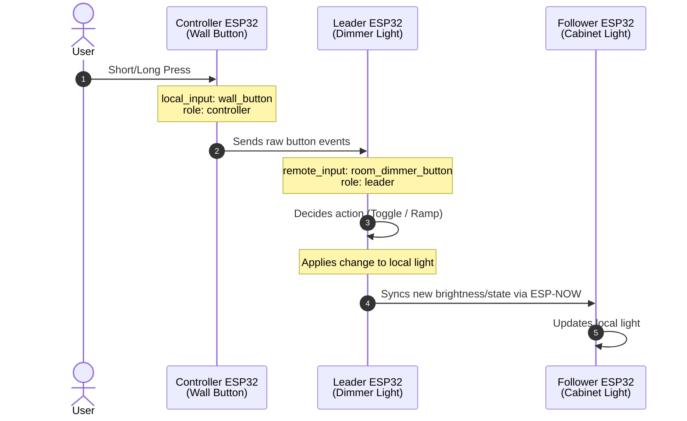

# ChimeraFX Sync

`cfx_sync` lets one leader light control other lights on nearby devices.

It is designed for ChimeraFX lights, but the basic light-state sync uses ESPHome's normal light state. That means standard ESPHome lights can follow power, brightness, and supported color channels too. ChimeraFX-only features, like effects and live controls, are copied only when the follower also has those ChimeraFX features.

Use it when you want, for example:

- One lamp to copy another lamp.
- One master strip to control segments on another device.
- A small wall-button ESP32 to control a ChimeraFX light somewhere else.
- A light with its own local button that also follows the room leader.

It can use ESP-NOW, UDP, or automatic transport selection. You do not need Home Assistant automations, MQTT, or copied MAC addresses.

> [!WARNING]
> **New Feature:** `cfx_sync` is ready for testing but is still new. Keep your first setup simple: one leader and one follower. Add more followers or controllers only after the basic sync works.

---

## The Simple Idea

Every sync setup has one `group` and one `key`.

Devices with the same `group` and `key` can find and trust each other.

There are four roles:

| Role | What it does |
| --- | --- |
| `leader` | The light everyone follows. |
| `follower` | A light that copies the leader. |
| `controller` | A device with only a button or switch. |
| `satellite` | A local light that follows the leader, and can optionally send local button input to the leader. |

---

## Sync Two Lights

Leader device:

```yaml
cfx_sync:
  id: room_sync
  role: leader
  lights: room_light
  group: living_room
  key: !secret cfx_sync_key # Or plain text: key: "living-room-sync"
```

Follower device:

```yaml
cfx_sync:
  id: room_sync
  role: follower
  lights: room_light
  group: living_room
  key: !secret cfx_sync_key # Or plain text: key: "living-room-sync"
```

If you are using ESPHome's `secrets.yaml` (recommended):

```yaml
cfx_sync_key: "living-room-sync"
```

That is enough for the first test.

When the leader turns on, changes brightness, color, effect, or supported ChimeraFX controls, the follower copies it.

---

## Sync One Leader To Multiple Follower Lights

A follower can apply the same leader state to more than one local light:

```yaml
cfx_sync:
  id: room_sync
  role: follower
  lights:
    - wall_segment_left
    - wall_segment_center
    - wall_segment_right
  group: living_room
  key: !secret cfx_sync_key
```

This is useful when the follower device has multiple segments and they should all follow the same leader.

---

## Temporarily Stop One Follower Or Satellite

Every follower and satellite automatically gets an **Enable Sync** switch in ESPHome and Home Assistant.

*   Turn **Enable Sync** off when you want that device to stop copying the leader for a while.
*   Turn **Enable Sync** on again when you want it back in the group.

When it is turned on, the device immediately asks the group for the current leader state. It does not wait for the next heartbeat, so this also works when `heartbeat` is set to a long value.

While **Enable Sync** is off:

- The device keeps discovery active.
- The device ignores leader state updates.
- Local light control still works.
- The device remains in the same `group`.

---

## Add A Remote Push Button

A controller device can have only a button and no ChimeraFX light.

Controller device:

```yaml
binary_sensor:
  - platform: gpio
    id: wall_button
    pin:
      number: GPIO10
      mode:
        input: true
        pullup: true
      inverted: true

cfx_sync:
  id: room_sync
  role: controller
  group: living_room
  key: !secret cfx_sync_key
  local_input: wall_button
```

Leader device:

```yaml
cfx_sync:
  id: room_sync
  role: leader
  lights: room_light
  group: living_room
  key: !secret cfx_sync_key
```

With this setup, pressing the remote button toggles the leader light. The leader then syncs the new light state to all followers.

`input_mode` defaults to `momentary`, which is the right mode for normal push buttons.

---

## Add A Satellite Light

Use `role: satellite` when one device has a local light that should follow the leader, and may also have a local button.

Satellite without `local_input`:

```yaml
cfx_sync:
  id: room_sync
  role: satellite
  lights: local_light
  group: living_room
  key: !secret cfx_sync_key
```

This behaves like a follower for the light, but any local button you configure outside `cfx_sync` stays private to that device.

ESP8266 devices can also be satellites when they use UDP transport. This is intentionally limited: an ESP8266 satellite follows the leader's ON/OFF state and brightness, and can send `local_input` button events. It does not run ChimeraFX effects and does not apply synced RGB/RGBW color, color temperature, cold/warm white, palettes, speed, intensity, Force White, intro, or outro controls.

Satellite with `local_input`:

```yaml
binary_sensor:
  - platform: gpio
    id: wall_button
    pin:
      number: GPIO10
      mode:
        input: true
        pullup: true
      inverted: true

cfx_sync:
  id: room_sync
  role: satellite
  lights: local_light
  group: living_room
  key: !secret cfx_sync_key
  local_input: wall_button
```

With `local_input`, pressing the satellite button controls the whole group:

1. The satellite sends the button press to the leader.
2. The leader changes its own light.
3. The leader sends the new state to every follower and satellite in the group.

This is intentional. A satellite button is not local-only once it is declared as `local_input`.

Rule of thumb:

| Configuration | Light follows leader | Button controls group |
| --- | --- | --- |
| `role: follower` | Yes | No |
| `role: controller` | No local sync light | Yes |
| `role: satellite` without `local_input` | Yes | No |
| `role: satellite` with `local_input` | Yes | Yes |

---

## Add A Rocker Switch

For a real ON/OFF switch, use `input_mode: maintained`.

Controller device:

```yaml
binary_sensor:
  - platform: gpio
    id: wall_switch
    pin:
      number: GPIO10
      mode:
        input: true
        pullup: true
      inverted: true

cfx_sync:
  id: room_sync
  role: controller
  group: living_room
  key: !secret cfx_sync_key
  local_input: wall_switch
  input_mode: maintained
```

With `maintained` mode:

- Switch ON turns the leader light ON.
- Switch OFF turns the leader light OFF.

Use `maintained` only when the physical switch position should be the source of truth. If Home Assistant or another controller may also turn the leader light on or off, a maintained switch can become out of sync with the real light state.

For a normal wall rocker that should act like a command on every state change, use `input_mode: toggle` instead.

With `toggle` mode, cfx_sync still waits for the rocker input to settle, but both stable switch edges toggle the leader:

```yaml
cfx_sync:
  id: room_sync
  role: controller
  group: living_room
  key: !secret cfx_sync_key
  local_input: wall_switch
  input_mode: toggle
```

- Switch ON toggles the leader light.
- Switch OFF toggles the leader light.
- The physical switch position is not treated as the desired light state.

---

## Add A Remote Dimmer Or Magic Button

If the remote button should dim, change CCT, cycle colors, or select effects, put the ChimeraFX button behavior on the leader with `cfx_button`.



Leader device:

```yaml
cfx_button:
  - id: room_dimmer_button
    dimmer:
      lights:
        - room_light

cfx_sync:
  id: room_sync
  role: leader
  lights: room_light
  group: living_room
  key: !secret cfx_sync_key
  remote_input: room_dimmer_button
```

Controller device:

```yaml
binary_sensor:
  - platform: gpio
    id: wall_button
    pin:
      number: GPIO10
      mode:
        input: true
        pullup: true
      inverted: true

cfx_sync:
  id: room_sync
  role: controller
  group: living_room
  key: !secret cfx_sync_key
  local_input: wall_button
```

In this setup, the controller sends the button press to the leader. The leader's `cfx_button` decides if it is a short press, long press, dimmer hold, or another ChimeraFX button action.

Do not use `input_mode: maintained` for a dimmer button.

> [!NOTE]
> A controller-only device does not control a local light directly. If you add a `cfx_button` helper on the controller side for a magic-button setup, its light list can be empty:
>
> ```yaml
> cfx_button:
>   - id: wall_dimmer
>     button: wall_button
>     dimmer:
>       lights: []
> ```
>
> This means "watch this physical button, but do not drive a local light." The leader-side `remote_input` is still the part that owns the real light target.

---

## Local Buttons On The Leader

If the button is physically connected to the leader device, you do not need `cfx_sync` for that button.

For a simple local push button, use normal ESPHome:

```yaml
binary_sensor:
  - platform: gpio
    id: local_button
    pin:
      number: GPIO10
      mode:
        input: true
        pullup: true
      inverted: true
    on_press:
      - light.toggle: room_light
```

For a local dimmer, CCT button, hue cycler, or effect selector, use [`cfx_button`](cfx_magic_buttons.md).

`cfx_sync` watches the leader light. When the leader changes, followers are updated automatically.

---

## What Gets Copied

`cfx_sync` copies:

- ON/OFF state.
- Brightness.
- RGB and RGBW color.
- White channel when available.
- Color temperature when both lights support it.
- Cold white and warm white channels when both lights support them.
- ChimeraFX effect selection.
- ChimeraFX controls such as Force White, Speed, Intensity, Palette, Mirror, Intro, Outro, and In/Out Duration when those controls exist.

It does not yet copy:

- Exact animation phase.
- Random effect seed.
- Full ChimeraFX light behavior on ESP8266. ESP8266 satellites are basic UDP light followers for ON/OFF and brightness only.

---

## Normal ESPHome Lights

You can use `cfx_sync` with normal ESPHome lights when you only need the usual light state:

- ON/OFF.
- Brightness, if the light supports brightness.
- RGB/RGBW color, if the light supports it.
- Color temperature or cold/warm white, if the light supports it.

Effects and ChimeraFX controls are still ChimeraFX features. A normal ESPHome light can follow the visual state, but it will ignore ChimeraFX effects, palettes, speed, intensity, intro, outro, and Force White.

This is useful for mixed rooms. For example, a ChimeraFX leader can sync the basic state to a PWM, Tuya, or monochrome ESPHome light. The result depends on what that follower light can actually do.

---

## Effects And Presets

Effects are matched by ID and name.

If the leader uses `Energy`, the follower must also have the `Energy` effect. If the leader uses a custom preset, the follower needs the same preset name and effect ID.

If the follower cannot find the effect, it falls back to `None` and keeps the synced power, brightness, and color.

Non-ChimeraFX and lambda effects are not synchronized yet.

---

## RGB And RGBW Lights

The best result comes from matching hardware:

- RGB leader to RGB follower.
- RGBW leader to RGBW follower.

Mixed RGB and RGBW devices are supported, but they may not look perfectly identical. ChimeraFX converts the color in a predictable way:

- RGBW to RGB folds white into RGB.
- RGB to RGBW moves neutral RGB into the white channel.

Different strips, white LEDs, power supplies, and calibration can still make two lights look slightly different.

---

## Multiple Groups

A device can belong to more than one sync group by declaring more than one `cfx_sync` block. Each block owns its own `group`, `key`, role, and light list.

Use this when one device has two independent lights that should follow two different rooms:

```yaml
cfx_sync:
  - id: kitchen_sync
    role: follower
    lights: kitchen_strip
    group: kitchen
    key: !secret cfx_sync_key

  - id: dining_sync
    role: follower
    lights: dining_strip
    group: dining_room
    key: !secret cfx_sync_key
```

Keep each light in only one sync group. If the same light is configured in two groups, the groups will fight over it.

---

## Wi-Fi And Mesh Networks

> [!WARNING]
> **Wi-Fi Channel Match Required:** ESP-NOW communication requires all synced devices to be on the same 2.4 GHz Wi-Fi channel.
>
> In mesh Wi-Fi networks (like UniFi, Eero, Google Nest), different mesh access points often run on different channels. If your Leader connects to mesh node A (Channel 1) and your Follower connects to mesh node B (Channel 6), they **will not** hear each other.
>
> **How to fix this:**
> 1. Lock the 2.4 GHz channels on your Wi-Fi access points so they all use the same static channel (usually channel 1, 6, or 11).
> 2. Check your ESPHome logs to verify which Wi-Fi channel and BSSID each device is using.
> 3. Avoid setting `fast_connect: true` in your ESPHome Wi-Fi settings unless you are sure the device will join the correct AP.

This warning is for ESP-NOW. UDP sync uses your normal network instead, so it can work through Wi-Fi or wired LAN when the devices can reach each other on the same network.

Wired LAN does not replace the ESP-NOW radio requirement. If a device uses Ethernet but still keeps Wi-Fi enabled on the same 2.4 GHz channel, ESP-NOW can still work. If the device is LAN-only with Wi-Fi disabled or unavailable, use UDP transport instead.

---

## Transport

Most ESP32 users should keep the default:

```yaml
cfx_sync:
  # ...
  transport: auto
```

Default `auto` behavior:

- ESP32 leaders can bridge ESP-NOW and UDP.
- ESP32 followers, satellites, and controllers can use ESP-NOW.
- ESP8266 controllers and basic satellites use UDP.

You can force a transport when you know what you need:

```yaml
cfx_sync:
  # ...
  transport: espnow
```

```yaml
cfx_sync:
  # ...
  transport: udp
```

Use UDP when:

- The device has Ethernet or cannot use ESP-NOW.
- You are using an ESP8266 controller or basic satellite.
- Your Wi-Fi mesh makes ESP-NOW channel alignment difficult.

Use ESP-NOW when:

- All devices are ESP32.
- You want the lowest input latency.
- All devices can stay on the same 2.4 GHz Wi-Fi channel.

---

## Offline Fallback Channel

`fallback_channel` is used when Wi-Fi is offline but the device is still running:

```yaml
cfx_sync:
  # ...
  fallback_channel: 6
```

Default: `6`.

Use the same fallback channel on every device in the group.

> [!NOTE]
> This is best-effort. ESPHome may still reboot the device if Wi-Fi is down for too long. `cfx_sync` does not disable ESPHome's normal Wi-Fi behavior.

---

## Options

| Option | Default | Used by | Description |
| --- | --- | --- | --- |
| `id` | generated | all | ESPHome component ID. |
| `role` | required | all | `leader`, `follower`, `controller`, or `satellite`. |
| `lights` | none | leader, follower, satellite | The light or lights controlled by sync. |
| `group` | required | all | Name of the sync group. |
| `key` | required | all | Shared passphrase, 8 to 64 characters. |
| `heartbeat` | `30s` | leader, follower, satellite | Regular full-state update. Valid range: `10s` to `5min`. |
| `fallback_channel` | `6` | all | ESP-NOW channel used while Wi-Fi is offline. |
| `transport` | `auto` | all | `auto`, `espnow`, or `udp`. |
| `local_input` | none | controller, satellite | Binary sensor used as a group input. |
| `input_mode` | `momentary` | controller, satellite | `momentary` for push buttons, `toggle` for rocker switches that should toggle on both edges, or `maintained` when switch position must be authoritative. |
| `remote_input` | none | leader | Optional leader-side `cfx_button` for remote dimmer or magic-button behavior. |

Important rules:

- A leader must have exactly one light.
- A follower must have at least one light.
- A satellite must have at least one light.
- A controller must have `local_input` and no `lights`.
- `remote_input` is only for leaders.
- Do not use `espnow_id` or `peer`; discovery is automatic.
- ESP32 followers and satellites get an automatic **Enable Sync** switch. It is not a YAML option.
- ESP8266 satellites use UDP and do not get the automatic **Enable Sync** switch in this first version.

---

## Troubleshooting

### Follower does nothing:
*   [ ] Verify `group` and `key` are spelled exactly the same on all devices.
*   [ ] On ESP32 followers or satellites, make sure the **Enable Sync** switch is turned on in Home Assistant or ESPHome.
*   [ ] Confirm full ChimeraFX light followers are ESP32s. ESP8266 satellites only support basic ON/OFF and brightness over UDP.
*   [ ] If using ESP-NOW, check that the devices are on the same 2.4 GHz Wi-Fi channel.
*   [ ] If using mesh Wi-Fi with ESP-NOW, check that the BSSID/channel did not split between mesh nodes.
*   [ ] If using UDP, check that the devices are on the same network and can reach each other.

### Remote button does nothing:
*   [ ] Confirm the button device is configured with `role: controller` or `role: satellite`.
*   [ ] Check that `local_input` matches the ID of your physical `binary_sensor`.
*   [ ] **Push Button:** Ensure `input_mode` is set to `momentary` (default).
*   [ ] **Rocker Switch:** Ensure `input_mode` is set to `toggle`.
*   [ ] **Maintained Toggle:** Use `maintained` only when you want the physical switch position to dictate state.

### Remote dimmer does not dim:
*   [ ] Confirm the leader has `remote_input` configured.
*   [ ] Verify the leader's `remote_input` points to a valid local `cfx_button` ID.
*   [ ] Confirm the controller's `input_mode` is set to `momentary`.

### Satellite button controls every light:
*   [ ] This is expected when the satellite has `local_input`.
*   [ ] Remove `local_input` from `cfx_sync` if the button should stay local-only.

### Follower effect becomes `None`:
*   [ ] Verify the follower light has the exact same ChimeraFX effect ID and name configured.
*   [ ] Ensure you are not trying to sync non-ChimeraFX or custom lambda effects (they are not supported yet).
